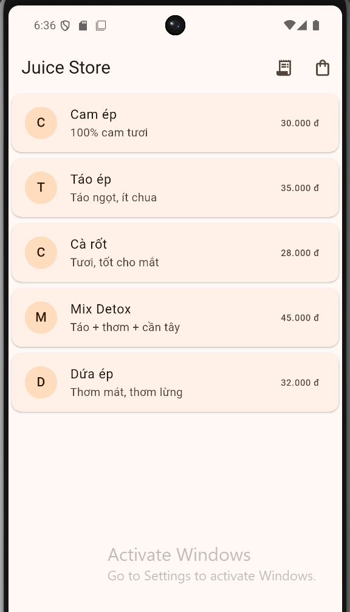
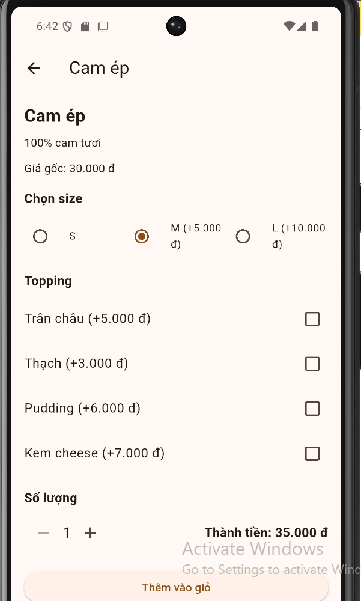

# Juice Store (Flutter)

Ứng dụng đặt nước ép đơn giản viết bằng Flutter.

## Features
- Danh sách sản phẩm
- Chọn size + topping
- Giỏ hàng
- Checkout tạo đơn
- Xem lịch sử đơn hàng

## Tech
- Flutter / Dart

### 2) Thêm ảnh screenshot vào repo
1. Chạy app trên emulator
2. Chụp 2–3 ảnh (Home / Cart / Checkout)
3. Tạo thư mục trong project: `assets/screenshots/`
4. Copy ảnh vào đó (ví dụ: `home.png`, `cart.png`, `checkout.png`)
5. Cập nhật `README.md` thêm đoạn này dưới mục Screenshots:

```md
## Screenshots


